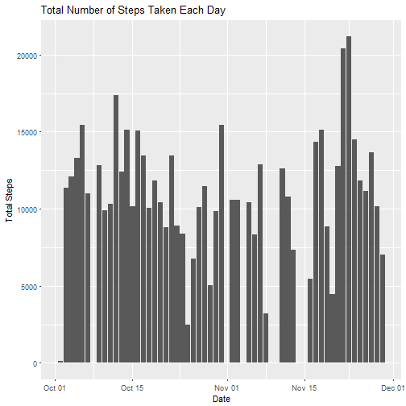
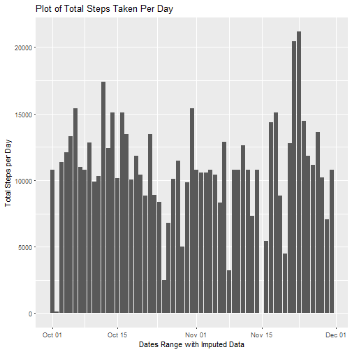

Reproducible Research: Project 1 (Activity Assignment)
====================

This an R markdown file generated for completion of the Coursera Reproducible Research Course Project 1 (Week 2). 


```r
library(ggplot2)
```


### (1) Code for reading in the dataset and/or processing the data
The following code reads the data file *activity.csv* which is in the working directory.


```r
activity <- read.csv("activity.csv")
activity$date1<-as.Date(as.character(activity$date), '%Y-%m-%d')
activity_ag <- aggregate(steps~date1, data=activity, FUN=sum,na.rm=TRUE)
activity_ag<-activity_ag[order(activity_ag$date1),]
```

### (2) Histogram of the total number of steps taken each day
The following code produces a Histogram of the total number of steps taken each day.


```r
ggplot(activity_ag) + geom_col(aes(x=date1,y=steps,group=date1,fill=steps)) +
  xlab("Date") + ylab("Total Steps") + ggtitle("Total Number of Steps Taken Each Day")
```



### (3) Mean and median number of steps taken each day


```r
activity_int <- aggregate(steps ~ interval, data=activity, FUN=mean)

print(paste0("Mean steps: ", steps_mean<-mean(activity_ag$steps)))
```

```
## [1] "Mean steps: 10766.1886792453"
```


```r
print(paste0("Median steps: ", steps_median<-median(activity_ag$steps)))
```

```
## [1] "Median steps: 10765"
```

### (4) Time series plot of the average number of steps taken


```r
activity_IntAg <- aggregate(steps ~ interval, activity, mean, rm.na=TRUE)

plot(x = activity_IntAg$interval,y = activity_IntAg$steps,
        type = "l",lwd=2,
        main = "Average Number of Steps Taken Across Study Interval",
        xlab = "5 Minute Intervals Averages (Mean)",
        ylab = "Average Number of Steps Taken")
```


### (5) The 5-minute interval that, on average, contains the maximum number of steps


```r
print(paste0("The 5-minute interval containing the maximum number of steps: ",
activity_IntAg$interval[which.max(activity_IntAg$steps)]))
```

```
## [1] "The 5-minute interval containing the maximum number of steps: 835"
```

### (6) Code to describe and show a strategy for imputing missing data

```r
sum(is.na(activity))
```

```
## [1] 2304
```


```r
#create new data group for adding fake data to missing steps
activity_mrg <- activity

#create a function to return steps mean from time interval
step_interval <- function(int){
  activity_IntAg$steps[activity_IntAg$interval==int]
}
#testing function over missing data
#step_interval(activity_mrg$interval[is.na(activity_mrg$steps)])

#replace na data with mean steps
activity_mrg$steps[is.na(activity_mrg$steps)]<- round(as.numeric(lapply(activity_mrg$interval[is.na(activity_mrg$steps)],step_interval), digits = 0))

activity_mrg_ag <- aggregate(steps~date1, data=activity_mrg, FUN=sum,na.rm=TRUE)
activity_mrg_ag <- activity_mrg_ag[order(activity_mrg_ag$date1),]
```
### (7) Histogram of the total number of steps taken each day after missing values are imputed


```r
ggplot(activity_mrg_ag) + geom_col(aes(x=date1,y=steps,group=date1,fill=steps)) +
  xlab("Dates Range with Imputed Data")+
  ylab("Total Steps per Day")+
  ggtitle("Plot of Total Steps Taken Per Day")
```



### (8) Panel plot comparing the average number of steps taken per 5-minute interval across weekdays and weekends


```r
activity_mrg_int <- aggregate(steps ~ interval, data=activity_mrg, FUN=mean)

print(paste0("Mean steps taken over imputed interval: ", steps_mrg_mean<-mean(activity_mrg_ag$steps)))
```

```
## [1] "Mean steps taken over imputed interval: 10765.6393442623"
```


```r
print(paste0("Median steps taken over imputed interval: ", steps_mrg_median<-median(activity_mrg_ag$steps)))
```

```
## [1] "Median steps taken over imputed interval: 10762"
```


```r
activity_int_mrg_ag <- aggregate(steps ~ interval, activity_mrg, mean, rm.na=T)

activity_wkends<-activity[weekdays(as.Date(activity$date)) %in% c("Saturday", "Sunday"),]
activity_wkdays<-activity[weekdays(as.Date(activity$date)) %in% c("Monday","Tuesday","Wednesday","Thursday","Friday"),]

activity_int_wkend_ag <- aggregate(steps ~ interval, activity_wkends, mean, rm.na=T)
activity_int_wkday_ag <- aggregate(steps ~ interval, activity_wkdays, mean, rm.na=T)
par(mfrow = c(2, 1))
plot(x = activity_int_wkend_ag$interval,y = activity_int_wkend_ag$steps,
        type = "l",lwd=2, col="red",
        main = "Average Number of Steps Taken Across Study Interval Weekends",
        xlab = "5-Minute Intervals",
        ylab = "Steps")

plot(x = activity_int_wkday_ag$interval,y = activity_int_wkday_ag$steps,
        type = "l",lwd=2, col="blue",
        main = "Average Number of Steps Taken Across Study Interval Weekdays",
        xlab = "5-Minute Intervals",
        ylab = "Steps")
```


